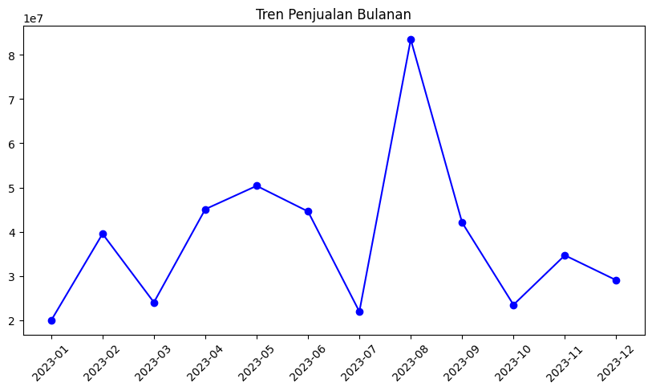
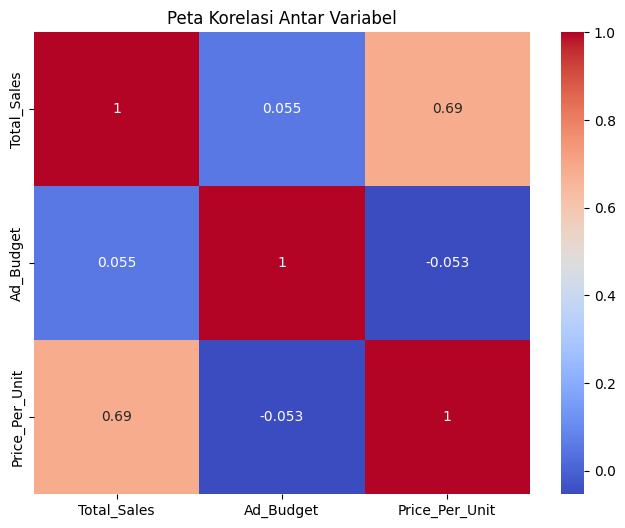
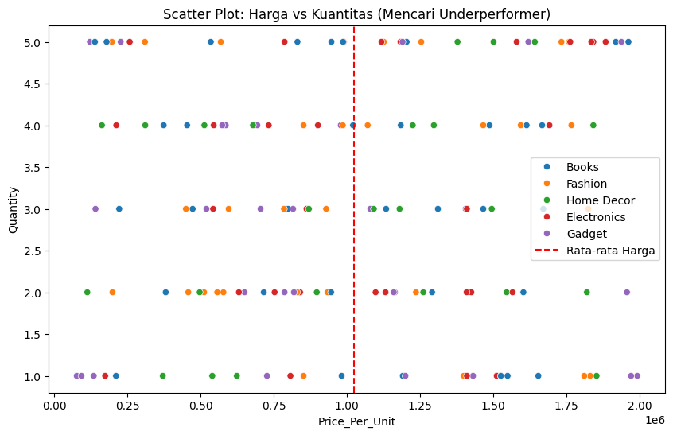
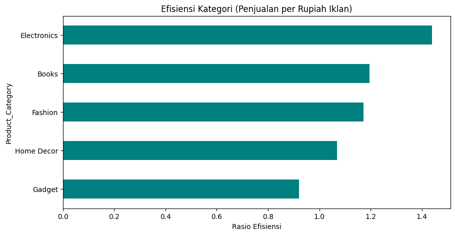

# E-commerce Sales Data

## Overview
This dataset contains synthetic sales data from a hypothetical e-commerce company. It includes information about orders, products, customers, and purchase details.

## Columns
- `Order ID`: A unique identifier for each order.
- `Product Name`: The name of the product.
- `Category`: The category of the product.
- `Price`: The price of a single unit of the product.
- `Quantity`: The quantity of the product ordered.
- `Total Sales`: The total sales amount for the order (price * quantity).
- `Customer ID`: A unique identifier for each customer.
- `Customer Age`: The age of the customer.
- `Customer Gender`: The gender of the customer.
- `Purchase Date`: The date of the purchase.
- `Purchase Time`: The time of the purchase.

# Laporan Praktikum: Analisis Performa Penjualan E-commerce

## 1. Business Question
Laporan ini bertujuan untuk menjawab beberapa pertanyaan kunci bisnis, antara lain:
* Bagaimana tren penjualan bulanan selama periode data tersedia?
* Apakah anggaran iklan berpengaruh signifikan terhadap total penjualan?
* Siapa saja pelanggan yang masuk dalam segmen prioritas (Loyal)?
* Kategori produk mana yang paling efisien dalam penggunaan budget iklan?

## 2. Data Wrangling
Proses pembersihan data yang dilakukan meliputi:
* **Filtering:** Menghapus data transaksi yang memiliki harga satuan (`Price_Per_Unit`) kurang dari atau sama dengan 0 untuk menghindari anomali data.
* **Tipe Data:** Mengonversi kolom `Order_Date` menjadi format *datetime* untuk memungkinkan analisis berbasis waktu (Tren & RFM).

## 3. Insights (Analisis & Visualisasi)

### A. Tren Penjualan & Korelasi

*Insight: Grafik ini menunjukkan fluktuasi penjualan tiap bulan. Terlihat adanya kenaikan/penurunan pada bulan tertentu yang bisa menjadi dasar evaluasi stok.*

*Insight: Heatmap menunjukkan korelasi antara variabel. Nilai korelasi yang tinggi antara Ad_Budget dan Total_Sales menandakan iklan sangat efektif.*

### B. Produk Underperformer

*Insight: Titik-titik di sebelah kanan garis merah (rata-rata harga) yang berada di bagian bawah grafik menunjukkan produk yang mahal namun penjualannya rendah.*

### C. Segmentasi Pelanggan (RFM)
Berdasarkan analisis RFM, pelanggan telah dikelompokkan. Pelanggan dengan skor **555** adalah pelanggan terbaik yang harus dipertahankan.

### D. Efisiensi Kategori

*Insight: Kategori dengan bar terpanjang menunjukkan pengembalian nilai penjualan tertinggi untuk setiap rupiah yang dihabiskan pada iklan.*

## 4. Recommendation
Berdasarkan analisis di atas, rekomendasi bagi perusahaan adalah:
1. **Optimasi Budget:** Alihkan sebagian anggaran iklan dari kategori yang tidak efisien ke kategori yang memiliki rasio efisiensi tinggi.
2. **Loyalty Program:** Segera kirimkan promo eksklusif untuk pelanggan di segmen RFM terbaik agar tingkat retensi tetap tinggi.
3. **Strategi Harga:** Evaluasi kembali produk *underperformer*, pertimbangkan untuk memberikan diskon agar stok cepat terjual (arus kas).
